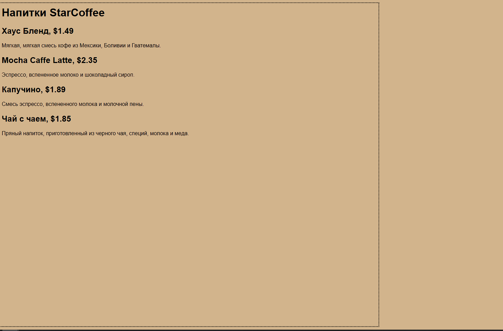

Учебное заведение – Geekbrains (пакет разработчик)
(специальность  разработчик – веб – разработка на Java)
Дипломный проект "Создание мобильного приложения, сайта кафе  StarCoffee" 
(Студент Ахмедханов Роман Магирович)
г. Санкт-Петербург,2023 года написания.

                                            Содержание

Введение                                                1

Как начать                                              3

Инструменты используемые для разработки                 4

Стоит ли прибегать к паттернам проектирования?          5   

Создаём главную страницу сайта                          11  

Мини приложение на андроид                              32  

Хранение информации в базах данных SQLite               38 

Стоит ли использовать JavaScript для нашего сайта       43  

Об проекте                                              45 

Благодарности                                           46 
                        
Концовка                                                50

                          

                                                    0

Введение
Что необходимо для чтения этого проекта
Понимание диаграмм, изучали язык программирования (в данном случае используется Java, в том числе и при создании приложения на андроид), необходимо знать HyperText Markup Language (язык гипертекстовой разметки), или сокращенно HTML/CSS. 
Почему Java? Java - один из самых важных и широко используемых языков программирования в мире. На протяжении многих лет ему была присуща эта отличительная особенность. В отличие от ряда других языков программирования, влияние которых с течением времени ослабевало, влияние Java становилось только сильнее. С момента своего первого выпуска язык Java выдвинулся на передний край программирования для Интернета. Его позиции закреплялись с каждой последующей версией. На сегодняшний день Java по-прежнему является первым и лучшим выбором для разработки веб-приложений, а также мощным языком программирования общего назначения, подходящий для самых разных целей. Проще говоря, большая часть современного кода написана на Java. Язык Java действительно настолько важен. 
Скорость обработки структуры данных и алгоритмы скорее всего рассматриваться не будут, хотя являются фундаментом современного компьютерного программирования.  Немного будут показаны диаграммы.
Это графический язык, в котором каждой фигуре, символу, стрелке или их сочетаниям присвоены конкретные значения. Пример указан ниже (UML). HTML предназначен для создания базовой структуры страниц, организации их содержимого и распространения информации. Фактически, при построении веб-приложений HTML/5,CSS, JavaScript охватывают три направления: структуру, стиль и функциональность. Andriod – самая популярная платформа в мире, полнофункциональная  с открытым кодом на базе Linux.

                                                    1

Это мощная платформа разработки, включающая всё необходимое для построения современных приложений. 
Диаграмма UML

                                                    2

Как начать

В любом деле самое сложное – это начало. Ещё до написания первой своей программы я думал, что программисты – это элитная группа специалистов, обладающих талантом, превосходящим всё, чем я могу обладать. Сразу же хочу пояснить, что это не так.  При наличии времени, усердия и доступа к Интернету любой человек сможет начать программировать. Начнём с построения структуры, понимания того что нужно сделать, что нам пригодиться для достижения цели. Одна из самых замечательных преимуществ создания продукта – это возможность воплощать свои идеи в жизнь. Данный опыт является хорошим преимуществом – он демонстрирует технические знания и способность понимать абстрактные концепции и решать сложные проблемы.
Название "StarCoffee" выдуманное мною. Пользователю будет доступно страничка, мини-приложение (пока локально).  Сделаем выбор сортов кофе, меню с ценами, многострочное текстовое поле для ввода информации, пункты меню, флажки, переключатели и немного другого.
Все будет описано в МойОфис, дополнительно продублирую копию в markdown файл. Чтобы все заработало, описанный код должен быть запущен в вашем редакторе. Вдохновляюсь книгами, статьями. Самый мощный источник данных Интернет.

                                                    3

                                                Инструменты используемые для разработки

Потребуется установить Java Development Kit (JDK) — это комплект ПО для разработчиков приложений на Java.  Стандартная установка включает в себя интерпретатор, облегчённый интерпретатор JRE, компилятор, библиотеку Java-классов, отладчик, средства архивации и сжатия jar и другое. Чтобы установить JDK нужно: загрузить актуальную версию пакета, установить его, настроить переменные окружения. Выбрать редактор, к примеру IntelliJ IDEA - интегрированная среда разработки программного обеспечения для многих языков программирования, в частности Java, JavaScript, Python, разработанная компанией JetBrains. В IDE входят: текстовый редактор для написания кода, компилятор, отладчик. Под вёрстку использую Sublime - проприетарный текстовый редактор. Поддерживает плагины на языке программирования Python. Разработчик позволяет бесплатно и без ограничений ознакомиться с продуктом. Редактор содержит различные визуальные темы, с возможностью загрузки дополнительных. Пакет Android Software Development Kit (SDK) содержит библиотеки и инструменты, необходимые для разработки Android-приложений. Android Studio — версия IDEA, которая включает версию Android SDK и дополнительные инструменты графических интерфейсов, упрощающие разработку приложений. Кроме редактора и доступа к инструментам и библиотекам из Android SDK, Android Studio предоставляет шаблоны, упрощающие создание новых приложений и классов, а также средства для выполнения таких операций, как упаковка приложений и их запуск.  Поэтому устанавливаем и его.

                                                        4

                                                        Стоит ли прибегать к паттернам проектирования?

Наверняка вашу задачу кто-то уже решал. Почему (и как) следует использовать опыт других разработчиков, которые уже сталкивались с аналогичной задачей и успешно решили её. Какова польза об использовании и преимуществах паттернов проектирования, познакомимся с ключевыми принципами объектно-ориентированного (ОО) проектирования и разберем пример одного из паттернов. Лучший способ использовать паттерны — запомнить их, а затем научиться распознавать те места ваших архитектур и существующих приложений, где их уместно применить. Таким образом, вместо программного кода вы повторно используете чужой опыт. 
Сеть кофеен StarCoffee может стремительно развиваться. Из-за бурного роста руководству StarCoffee никак не удается привести свою систему заказов в соответствие с реальным ассортиментом. Когда только начинался бизнес, иерархия классов выглядела примерно так...

К кофе можно заказать различные дополнения (пенка, шоколад и т. д.), да еще украсить все сверху взбитыми сливками. Дополнения не бесплатны, поэтому они должны быть встроены в систему оформления заказов. 
                                                     5

С таким подходом классы начнут стремительно размножатся. Будет ли наследование лучшим решением из данной ситуации? Чтобы понять потенциальные недостатки такого подхода, достаточно подумать, как эта архитектура может измениться в будущем. Итак, схема вычисления стоимости напитка с дополнениями посредством наследования обладает рядом недостатков: это и разрастание классов, и негибкая архитектура, и присутствие в базовом классе функциональности, неуместной в некоторых субклассах. Поэтому мы поступим иначе: начнем с базового напитка и «декорируем» его на стадии выполнения. Например, если клиент заказывает кофе темной обжарки с шоколадом и взбитыми сливками, то тогда начинаем с объекта темной обжарки, декорируем его объектом шоколадом, декорируем его объектом взбитыми сливками, пользуемся делегированием для прибавления стоимости дополнений. 
Так мы подходим к паттерну Декоратор. Имеющие следующие свойства:
декораторы имеют тот же супертип, что и декорируемые объекты, объект можно «завернуть» в один или несколько декораторов, так как декоратор относится к тому же супертипу, что и декорируемый объект, мы можем передать декорированный объект вместо исходного, декоратор добавляет свое поведение до и (или) после делегирования операций декорируемому объекту, выполняющему остальную работу, объект может быть декорирован в любой момент времени, так что мы можем декорировать объекты динамически и с произвольным количеством декораторов.
Паттерн Декоратор динамически наделяет объект новыми возможностями и является гибкой альтернативой субклассированию в области расширения функциональности. Следующая диаграмма выглядит более содержательно.

                                                        6

Напишем немного кода. Начнем с класса Beverage

public abstract class Beverage { 
String description = "Неизвестный напиток"'; 
public String getDescription() {
 return description; 
} 
public abstract double cost(); 
}

Реализуем абстрактный класс для дополнений:
public abstract class CondimentDecorator extends Beverage { 
Beverage beverage;
 public abstract String getDescription();
}

                                                         7

Разобравшись с базовыми классами, переходим к реализации некоторых напитков.

public class Espresso extends Beverage { 
public Espresso() { description = "Эспрессо"; } 
public double cost() { return 1.99; } 
}

public class HouseBlend extends Beverage { 
public HouseBlend() { description = "Домашний купажированный кофе"; } 
public double cost() { return .89; } 
}
И другие
Далее программирование дополнений.

public class Mocha extends CondimentDecorator { 
public Mocha(Beverage beverage) { this.beverage = beverage; } 
public String getDescription() { return beverage.getDescription() + ", Мокко"; } 
public double cost() { return beverage.cost() + .20; } 
}
И другие

Тестовый код для оформления заказов:

public class StarCoffee {
public static void main(String args[]) { 
Beverage beverage = new Espresso(); System.out.println(beverage.getDescription() + " $" + beverage.cost()); 

                                                          8

Beverage beverage2 = new DarkRoast(); beverage2 = new Mocha(beverage2); 
beverage2 = new Mocha(beverage2); beverage2 = new Whip(beverage2); 
System.out.println(beverage2.getDescription() + " $" + beverage2.cost()); Beverage beverage3 = new HouseBlend(); beverage3 = new Soy(beverage3); beverage3 = new Mocha(beverage3); beverage3 = new Whip(beverage3); System.out.println(beverage3.getDescription() + " $" + beverage3.cost()); }
}

Результат
Эспрессо $1.99 Темный обжаренный кофе, Мокко, Мокко, Взбить $1.49 
Домашний купажированный кофе, Соя, Мокко, Взбить $1.34

Мы рассмотрели типичные злоупотребления из области наследования, и  научились декорировать свои классы во время выполнения с использованием разновидности композиции. Зачем? Затем, что этот прием позволяет вам наделить свои (или чужие) объекты новыми возможностями без модификации кода классов. 
В дальнейшем введем в меню разные размеры порций. Теперь кофе можно заказать в маленькой, средней или большой чашке. StarCoffee считает размер порции неотъемлемой частью класса кофе, поэтому в класс Beverage были добавлены два новых метода: setSize() и getSize(). Стоимость дополнений также зависит от размера порции, так что, скажем, добавка сои должна стоить 10, 15 или 20 центов для маленькой, средней или большой порции соответственно. Обновим класс.
public abstract class Beverage {
public enum Size { TALL, GRANDE, VENTI }; 
Size size = Size.TALL; 
String description = "Неизвестный напиток";
 public String getDescription() { return description; } 

                                                         9

public void setSize(Size size) { this.size = size; }
 public Size getSize() { return this.size; } 
public abstract double cost();
 }

Пример кода декоратора после изменения
public abstract class CondimentDecorator extends Beverage { 
public Beverage beverage; 
public abstract String getDescription(); 
public Size getSize() { return beverage.getSize(); } 
}

public class Soy extends CondimentDecorator { 
public Soy(Beverage beverage) { this.beverage = beverage; } 
public String getDescription() { return beverage.getDescription() + ", Соя"; } public double cost() { double cost = beverage.cost(); 
if (beverage.getSize() == Size.TALL) { cost += .10; } 
else if (beverage.getSize() == Size.GRANDE) { cost += .15; } 
else if (beverage.getSize() == Size.VENTI) { cost += .20; } return cost; } 
}
Решение написания данного кода способствовал паттерн. Приведу формальное определение паттерна проектирования. Паттерн — решение задачи в контексте.
Контекстом называется ситуация, в которой применяется паттерн. Ситуация должна быть достаточно типичной и распространенной. Задачей называется цель, которой вы хотите добиться в контексте, в совокупности со всеми ограничениями, присущими контексту. Решением называется обобщенная архитектура, которая достигает заданной цели при соблюдении набора ограничений. (Используем IntelliJ IDEA)

                                                         10

Создаём главную страницу сайта

Единственное, что необходимо для того, чтобы успешно работать в Сети, — научиться говорить на ее специфическом языке: HyperText Markup Language (язык гипертекстовой разметки), или сокращенно HTML. Кафе StarCoffee может быстро развиваться. Поэтому не исключено, что может появится главная страничка для заказов кофе. Начнем с самого начала. Нужно ввести некоторую информацию в текстовый редактор, сохранить ее, а затем загрузить в свой браузер. Начнем вводить информацию о напитках. 
Напитки кафе StarCoffee

Домашняя смесь, $1,49
Мягкая, нетерпкая смесь различных сортов кофе из Мексики, Боливии и Гватемалы.
Кофе мокко, $2,35
Экспрессо, кипячёное молоко и шоколадный сироп.
Капучино, $1,89
Смесь экспрессо и кипячёного молока с добавлением пены.

После того как перенесём информацию о напитках в текстовый редактор, нужно сохранить работу в файле под названием index.html. Если открыть страницу в браузере, то результат неудовлетворительный.  К настоящему моменту напечатали только содержание веб-страницы. Теперь в действие вступает HTML. Он дает вам возможность рассказать браузеру о структуре страницы. Какой структуре? Как вы уже поняли, это такой способ разметки текста, который показывает браузеру, что является заголовком, где начинается новый абзац, какой текст выделить как подзаголовок и т. д. Как только браузер немного узнает о структуре 

                                                          11

страницы, он сможет отобразить ее более выразительно и страница станет более читабельной.
Создадим HTML-страницу с разметками

<html>
<head>
	<title>StarCoffee</title>
</head>

<body>
	<h1>StarCoffee</h1>

	<h2>Домашняя смесь , $1.49</h2>
	
Мягкая, нетерпкая смесь различных сортов кофе из Мексики, Боливии и Гватемалы.

	<h2>Кофе мокко, $2.35</h2>
	
Экспрессо, кипячёное молоко и шоколадный сироп.

	<h2>Капучино, $1.89</h2>
	
Смесь экспрессо и кипячёного молока с добавлением пены.

</body>
</html>

Теперь настало время сконцентрироваться на дизайне страницы. Тут на помощь приходит CSS, который дает возможность указать, как будет представлено содержимое страницы.

Пока добавим между тегами <head>....</head>. В основном его отделяют отдельно.
<!-- <head> -->
........................код
<!-- 
</head>

Страницу StarCoffee можно усовершенствовать, сделать дизайн более привлекательным и удобным для пользователя. Идея такова: наш HTML должен быть всецело посвящен структурированию содержимого, а CSS — это то, что обрабатывает макет. 
Дальнейшие изменения:
Создадим верхний колонтитул с замечательным логотипом StarCoffee и основной задачей компании. Изображение в формате GIF. Будут разделы с основным содержимым, с рекламой, нижний колонтитул. Для всей страницы используется один и тот же фоновый цвет. Ссылки на новый раздел кафе, где можем заказать себе напиток в режиме онлайн. Они работать не будут. У нижнего колонтитула нет фонового изображения, а есть лишь фоновый цвет. Ссылки подчеркнём точечными линиями.

Показ новой страницы

<!DOCTYPE html>
<html>
  <head>
    <meta charset="utf-8">
    <title>StarCoffee</title>
    <link rel="stylesheet" type="text/css" href="starcoffee.css">
  </head> 

  <body>
    

      
                                                    13

    

    

      <h1>КАЧЕСТВЕННЫЙ КОФЕ, КАЧЕСТВЕННЫЙ КОФЕИН</h1>
      

В StarCoffee мы стремимся удовлетворить все ваши потребности в кофеине с помощью наших качественный кофе и чай. Конечно, мы хотим, чтобы вы выпили чашечку отличного кофе и насладились им с удовольствием, но мы единственная компания, которая активно отслеживает и оптимизирует уровень кофеина. Так что заходите и наполните свою чашку или закажите онлайн наши новые бобы Заполните онлайн-форму заказа и получите качественный кофе StarCoffee, который, как вы знаете, будет соответствовать вашим стандартам по содержанию кофеина.
      

      

        И, упоминали ли мы об этом <em>кофеин</em>? Мы только что начали финансировать ребят, проводящих все эти замечательные исследования в<a href="http://.com"
        title="Читайте все о кофеине в Star">Star</a>.
       Если вы хотите узнать последние новости о кофе и других продуктах с кофеином, зайдите к ним в гости.
      

      <h1>НАША ИСТОРИЯ</h1>
      

        "Человек, план, кофейное зернышко". Ладно, это не палиндром, но в результате получилась чертовски вкусная чашка кофе. Генеральный директор StarCoffee - именно этот человек, и вы уже знаете его план: StarCoffee на каждом углу."
      
 
 

I

Всего за несколько лет он осуществил этот план, и сегодня вы можете наслаждаться StarCoffee практически в любом месте. И, конечно же, главной новостью этого года является то, что StarCoffee объединился с HF, чтобы создать веб-сайт StarCoffee, который быстро растет и помогает удовлетворить потребности в кофеине совершенно нового круга клиентов.
      

      <h1>StarCoffee Напитки</h1>
      

       В StarCoffee на выбор представлен широкий ассортимент напитков с 

                                                        14 

кофеином, включая наш

        <a href="beverages.html#house" title="House Blend">Домашняя смесь</a>,
        <a href="beverages.html#mocha" title="Mocha Cafe Latte">Мокко Кафе Латте</a>, 
        <a href="beverages.html#cappuccino" title="Cappuccino">Капучино</a>,
    
      

      

        Мы также предлагаем вам разнообразные кофейные зерна, цельные или молотые, чтобы вы могли
        я хочу быть дома с тобой. Закажите свой кофе сегодня, воспользовавшись нашим онлайн-сервисом        <a href="form.html" title="form.html">Bean Machine</a>,и возьмите с собой домой вкус кофе StarCoffee      

    

    

      

        
         
        ЗАКАЗЫВАЙТЕ ОНЛАЙН с помощью        <a href="form.html">BEAN MACHINE</a>
         
        
            быстрый  
            свежий  
            К ТВОЕЙ ДВЕРИ  
        
      

      

Зачем ждать? Вы можете заказать весь наш изысканный кофе прямо через Интернет с помощью нашей новой автоматической кофемашины. Как это работает? Просто нажмите на ссылку "Кофемашина для приготовления зерен", введите свой заказ, и за кулисами ваш кофе будет обжарен и смолот (если вы хотите), упакованы и отправлены к вашей двери.
      

    

    

      &copy; 2023, StarCoffee 
       
    
                                                       15

 Все товарные знаки и зарегистрированные товарные знаки, представленные на этом сайте, являются собственностью их соответствующих владельцев.
    

  </body>
</html>

А теперь продемонстрирую стиль

body { 
  background-color: #b5a789;
  font-family:      Georgia, "Times New Roman", Times, serif;
  font-size:        small;
  margin:           0px;
}

#header {
  background-color: #675c47;
  margin:           10px;
  height:           108px;
}

#main {
  background:       #efe5d0 url(images/background.gif) top left;
  font-size:        105%;
  padding:          15px;
  margin:           0px 10px 10px 10px;
}

#sidebar {
  background:       #efe5d0 url(images/background.gif) bottom right;
  font-size:        105%;
  padding:          15px;
  margin:           0px 10px 10px 10px;
}

#footer {
  background-color: #675c47;
  color:            #efe5d0;
  text-align:       center;
  
                                                    16

  padding:          15px;
  margin:           10px;
  font-size:        90%;
}

h1 {
  font-size:        120%;
  color:            #954b4b;
}

.slogan { color: #954b4b; }

.beanheading {
  text-align:       center;
  line-height:      1.8em;
}

a:link {
  color:            #b76666;
  text-decoration:  none;
  border-bottom:    thin dotted #b76666;
}
a:visited {
  color:            #675c47;
  text-decoration:  none;
  border-bottom:    thin dotted #675c47;
}

Теперь страница преобразилась. Покажем разницу в картинках.

Как выглядело до:

                                                      17

А теперь после

                                                     18

Далее можно поэкспериментировать. Сделать следующее: поместить купон на страницу так, чтобы он всегда отображался на экране, даже если пользователь применяет для прокрутки страницы колесико мыши. Это интересный способ поэкспериментировать с фиксированным позиционированием. Поместим на страницу купон "Бесплатный кофе":

 
 

Затем добавим CSS-код для позиционирования купона.
#coupon { 
             position: fi xed; 
             top: 350px; 
             // left: 0px; 
             left: -90px;   
}

#coupon а, img { 
            border: none; 
}

Страница выглядит замечательно, но станет ещё более привлекательной,
если сместить купон влево. В результате будет казаться, будто он выглядывает из окна просмотра. Можно использовать отрицательные значения смещения, чтобы левая сторона изображения располагалась за пределами окна просмотра. Как показано выше.

                                                       19

Кафе StarCoffee – это современное, модное заведение, в котором могут применяться новейшая и наилучшая разметка, прибегая к возможности HTML5

Следует отметить, что это интересная задача, поскольку многие из новых HTML5-элементов идеально подходят для создания блогов. Добавим красивое навигационное меню под верхним колонтитулом, в области основного содержимого несколько блог-постов, остальная часть останется прежней.

Введем измененный сайт

<!DOCTYPE html>
<html>
  <head>
    <meta charset="utf-8">
    <title>StarCoffee</title>
    <link rel="stylesheet" type="text/css" href="starbuzz.css">
  </head> 

  <body>
    <header class="top">
      
      
    </header>

	<nav>
	<ul>
		<li class="selected"><a href="index.html">Home</a></li>
		<li><a href="blog.html">Blog</a></li>
		<li><a href="">Изобретения</a></li>
		<li><a href="">Рецепты</a></li>
		<li><a href="">Локации</a></li>

                                                       20

	</ul>
	</nav>

	

	

	<section id="drinks">
		<h1>Напитки</h1>
			
Хаус Бленд, $1.49

			
Mocha Cafe Latte, $2.35

			
Капучино, $1.89

			<h1>Эликмсиры</h1>
			

				Мы с гордостью подаем эликсиры, сваренные нашими друзьями в Head First Lounge.
			

			
Концентрация малинового льда, $2.99

			
Черничный Bliss Elixir, $2.99

			
Клюквенный Antioxidant Blast, $2.99

			
Chai Chiller, $2.99

			
Black Brain Brew, $2.99

	</section>
    <section id="main">
      <h1>КАЧЕСТВЕННЫЙ КОФЕ, КАЧЕСТВЕННЫЙ КОФЕИН</h1>
      

В StarCoffee Coffee мы стремимся удовлетворить все ваши потребности в кофеине с помощью наших качественный кофе и чай. Конечно, мы хотим, чтобы вы выпили чашечку отличного кофе и насладились им с удовольствием, но мы единственная компания, которая активно отслеживает и оптимизирует уровень кофеина. Так что заходите и наполните свою чашку или закажите онлайн наши новые бобы Заполните онлайн-форму заказа и получите качественный кофе StarCoffee, который, как вы знаете, будет соответствовать вашим стандартам по содержанию кофеина.
      

      

        И, упоминали ли мы об этом <em>кофеин</em>? Мы только что начали финансировать ребят, проводящих все эти замечательные исследования в <a href="http://buzz.h.com"

        title="Read all about caffeine on the Buzz">Caffeine Buzz</a>.

        
                                                     21

       Если вы хотите узнать последние новости о кофе и других продуктах с кофеином, зайдите к ним в гости.
      

      <h1>НАША ИСТОРИЯ</h1>
      

 "Человек, план, кофейное зернышко". Ладно, это не палиндром, но в результате получилась чертовски вкусная чашка кофе. Генеральный директор StarCoffee - именно такой человек, и вы уже знаете его план: StarCoffee на каждом углу."
      
 
      
Всего за несколько лет он осуществил этот план, и сегодня вы можете наслаждаться StarCoffee практически в любом месте. И, конечно же, главной новостью этого года является то, что StarCoffee объединилась с HF, чтобы создать веб-сайт StarCoffee, который быстро растет и помогает удовлетворить потребности в кофеине совершенно нового круга клиентов.  
      

      <h1>StarCoffee COFFEE BEVERAGES</h1>
      

       В StarCoffee на выбор представлен широкий ассортимент напитков с кофеином, в том числе наш
        <a href="beverages.html#house" title="House Blend">House Blend</a>,
        <a href="beverages.html#mocha" title="Mocha Cafe Latte">Mocha Cafe Latte</a>, 
        
<a href="beverages.html#cappuccino" title="Cappuccino">Cappuccino</a>,
      

      

        Мы также предлагаем разнообразные кофейные зерна, цельные или молотые, которые вы можете взять с собой домой. Закажите свой кофе сегодня, воспользовавшись нашим онлайн-сервисом
        <a href="form.html" title="form.html">Bean Machine</a>, and take
        the StarCoffee  experience home.
      

    </section>

    <aside>
      

        

       
                                              
                                                     22

  
        Заказывайте онлайн
        с помощью 
        <a href="form.html">BEAN MACHINE</a>
         
        
            FAST  
            FRESH  
            TO YOUR DOOR  
        
      

      

Зачем ждать? Вы можете заказать весь наш изысканный кофе прямо через Интернет с помощью нашей новой автоматической кофемашины. Как это работает? Просто нажмите на ссылку "Кофемашина для приготовления зерен", введите свой заказ, и за кулисами ваш кофе будет обжарен и смолот (если вы хотите), упакованы и отправлены к вашей двери.
      

    </aside>
	
 <!-- tableRow -->
	
 <!-- tableContainer -->

    <footer>
      &copy; 2023, StarCoffee Coffee
       
    Все товарные знаки и зарегистрированные товарные знаки, представленные на этом сайте, являются собственностью их соответствующих владельцев.
    </footer>

  </body>
</html>

Добавление CSS

body { 
  background-color: #b5a789;
  font-family:      Georgia, "Times New Roman", Times, serif;
  font-size:        small;
  margin:           0px;
}

                                                   23    

/* 
высота портит заголовки в блоге, в статьях она подходит только для верхнего колонтитула.
	add a class (new with blog)
	Affects the 3 #header rules for the main header below
	In HTML: add class="top" to main header in index.html and blog.html
*/

header.top {
  background-color: #675c47;
  margin: 10px 10px 0px 10px;
  height:           108px;
}

header.top img#headerSlogan {
	float: right;
}

/* nav new in blog */
nav {
    background-color: #efe5d0;
	margin: 10px 10px 0px 10px;
}
nav ul {
	margin: 0px;
	list-style-type: none;
	padding: 5px 0px 5px 0px;
}
nav ul li {
	display: inline;
	padding: 5px 10px 5px 10px;
}

div#tableContainer {
	display: table;
	border-spacing: 10px;
}

div#tableRow {
	display: table-row;
}

                                                      24

section#drinks {
    display: table-cell;
    background-color: #efe5d0;
    width: 20%;
    padding: 15px;
    vertical-align: top;
}

/* added section#blog for blog */
section#main, section#blog {
  display: table-cell;
  background:       #efe5d0 url(images/background.gif) top left;
  font-size:        105%;
  padding:          15px;
  vertical-align: top;
}

aside {
  display: table-cell;
  background:       #efe5d0 url(images/background.gif) bottom right;
  font-size:        105%;
  padding:          15px;
  vertical-align: top;
}

footer {
  background-color: #675c47;
  color:            #efe5d0;
  text-align:       center;
  padding:          15px;
  margin: 0px 10px 10px 10px;
  font-size:        90%;
}

h1 {
  font-size:        120%;
  color:            #954b4b;
}

h2 { font-size: 110%; }

.slogan { color: #954b4b; }

                                                       25

.beanheading {
  text-align:       center;
  line-height:      1.8em;
}

a:link {
  color:            #b76666;
  text-decoration:  none;
  border-bottom:    thin dotted #b76666;
}
a:visited {
  color:            #675c47;
  text-decoration:  none;
  border-bottom:    thin dotted #675c47;
}

/* ALL BELOW IS NEW FOR BLOG */

/* BELOW a above to override for nav */
nav ul li a:link, nav ul li a:visited {
	color: #954b4b;
	border-bottom: none;
	font-weight: bold;

	/* optional! very hard to see although does help */
	text-shadow: 1px 1px 3px #e2c2c2; 

	/* try this and see if you like it */
	text-transform: uppercase;
}

li.selected {
	background-color: #c8b99c;
}

article span {
	font-style: italic;
}

                                                      26

Получилась славная навигационная панель, на которой даже выделена ссылка на блог-страницу. Можно усовершенствовать и дальше. 

А пока эта окончательная версия страницы кафе StarCoffee. Плюсом будет добавление видео. Сайт выглядит лучше и совершенно по-новому. Описано много полезной информации. Не хватает снабдить страницы формами(прибегнув к определённой помощи веб-сервера), при помощи которой сможем собирать отзывы клиентов, принимать по Сети заказы, проводить голосование. 

Так как StarCoffee развивается, тогда создадим 
отдельно онлайновую форму заказа наших напитков. Создадим страничку, в которой будет раскрывающийся список, поле для комментариев клиентов, флажки и переключатели, ячейки для заполнения своей информации,кнопка. Без создания серверных сценариев.

                                                        27

Поместим в форму практически любой блочный элемент, но это не то, что важно для нас на данный момент. Нас интересуют специальные элементы формы, которые создают элементы управления в браузере. На данной страничке можно выбрать вид  кофе, молотый или в зёрнах (можно выбрать только одно), подарочная упаковка или включить каталог (не выбрать ни одного или выбрать один или два), информация о заказчике и его адрес, состояние из шести текстовых полей, поле для комментариев клиентов,кнопка отправления заказа. 

Напишем код

<!doctype html>
<html>
  <head>
    <meta charset="utf-8">
    <title>The StarCoffee Bean Machine</title>
	<link rel="stylesheet" href="starbuzz.css">
	<link rel="stylesheet" href="styledform.css">
  </head>
  <body>

    <h1>The StarCoffee Bean Machine</h1>
    <h2>Fill out the form below and click "order now" to order</h2>

    <form action="http://www.php" method="post">
	

		

          Choose your beans:
		

		

            <select name="beans">
              <option value="House Blend">House Blend</option>
              <option value="Bolivia">Shade Grown Bolivia Supremo</option>
              <option value="Guatemala">Organic Guatemala</option>
              <option value="Kenya">Kenya</option>
            </select>
		

	
                                                   28     

	

		
 Type: 

		

            <input type="radio" name="beantype" value="whole"> Whole bean 
            <input type="radio" name="beantype" value="ground" checked> 
            Ground
		

	

	

		
 Number of bags: 

		
 <input type="number" name="bags" min="1" max="10"> 

	

	

		
 Must arrive by date: 

		
 <input type="date" name="date"> 

	

	

		
 Extras: 

		

            <input type="checkbox" name="extras[]" value="giftwrap"> Gift wrap 
            <input type="checkbox" name="extras[]" value="catalog" checked>
            Include catalog with order
		

	

	

		
 Ship to 

		

	

	

		
 Name: 

		
 <input type="text" name="name" value="" placeholder="Buckaroo Banzai" required> 

	

	

		
 Address: 

		
 <input type="text" name="address" value="" placeholder="Banzai Institute" required> 

	

	

	
                                                    29

	
 City: 

		
 <input type="text" name="city" value="" placeholder="Los Angeles" required> 

	

	

		
 State: 

		
 <input type="text" name="state" value="" placeholder="CA" required> 

	

	

		
 Zip: 

		
 <input type="text" name="zip" value="" placeholder="90050" required> 

	

	

		
 Phone: 

		
 <input type="tel" name="phone" value="" placeholder="310-555-1212" required> 

	

	

		
 Customer Comments: 

		

            <textarea name="comments"></textarea>
		

	

	

		

		
 <input type="submit" value="Order Now"> 

	

    </form>
  </body>
</html>

И конечно добавим стиль

body {
	background: #efe5d0 url(images/background.gif) top left;
	margin: 20px;
}

form {
	
                                                  30

display: table;
	padding: 10px;
	border: thin dotted #7e7e7e;
	background-color: #e1ceb8;
}

form textarea {
	width: 500px;
	height: 200px;
}

div.tableRow {
	display: table-row;
}

div.tableRow p {
	display: table-cell;
	vertical-align: top;
	padding: 3px;
}
div.tableRow p:first-child {
	text-align: right;
}
p.heading {
	font-weight: bold;
}
Итог

                        
                               31

Мини приложение на андроид

Когда разработчик задумывает новое приложение, у него обычно уже есть масса идей относительно того, что должно быть в этом приложении. Допустим, руководство сети кофеен StarCoffee хочет создать новое приложение, которое привлечет в их заведения больше народа. Добавив некоторые возможности, которые, как руководство считает должны быть реализованы в приложении: вывести подробную информацию пр каждому напитку, вывести список всех кофеен, вывести адреса и время работы всех кофеен. Полезный способ упорядочения таких идей заключается в их классификации на три типа активностей: активности верхнего уровня, активности категорий и активности детализации/редактирования.

Активности верхнего уровня представляют операции, наиболее важные для пользователя, и предоставляют простые средства для навигации к ним. В большинстве приложений первая активность, которую видит пользователь, является активностью верхнего уровня.

Активности категорий выводят данные, принадлежащие конкретной категории, — часто в виде списка. Такие активности часто помогают пользователю перейти к активностям детализации/ редактирования. Пример активности категории — вывод списка всех напитков, имеющихся в StarCoffee.

Активности детализации/редактирования выводят подробную информацию по конкретной записи, предоставляют пользователю возможность редактирования существующих записей или ввода новых записей. Пример активности детализации/ редактирования — активность, которая выводит подробную информацию о конкретном напитке. 

После того как разделим свои идеи на активности верхнего уровня, категорий и детализации/редактирования, эта классификация может использоваться для планирования навигации по приложению. Как правило, переход от активностей верхнего уровня к активностям детализации/ редактирования должен осуществляться через активности категорий.

Активности верхнего уровня во главе иерархии
Пользователь начинает работу с приложением с этих активностей, поэтому они размещаются в начале иерархии, после к категориям. Пользователи будут переходить от активностей верхнего уровня к активностям категорий. В сложных приложениях иерархия может включать несколько уровней категорий и подкатегорий.

                                                               32

 Для примера представьте, что пользователь хочет просмотреть подробную информацию об одном из напитков, подаваемых в StarCoffee. Для этого он запускает приложение и видит начальный экран активности верхнего уровня со списком команд. Пользователь выбирает команду вывода списка напитков. Чтобы увидеть подробную информацию о конкретном напитке, пользователь выбирает его в списке. В приложениях с такой структурой необходимо организовать навигацию, то есть переходы между активностями. В таких ситуациях чаще всего применяются списковые представления. Списковое представление отображает перечень объектов данных, который затем используется для навигации по приложению. 

Построим активность верхнего уровня, которую будет видеть пользователь при запуске приложения; активность категории, которая выводит список напитков; и активность детализации/редактирования, которая выводит подробную информацию об одном напитке. При запуске приложения пользователь видит активность верхнего уровня — главную точку входа приложения. Эта активность включает изображение логотипа StarCoffee и навигационный список с командами для получения информации о напитках, еде и кофейнях. Когда пользователь щелкает на одном из пунктов списка, приложение использует его выбор для перехода к другой активности. Например, если пользователь щелкнул на команде Drinks, приложение запускает активность категорий со списком напитков. 

В активности категории открывается при выборе пользователем команды Drinks в навигационном списке активности верхнего уровня. Активность выводит список всех напитков, продаваемых в кофейнях StarCoffee. Пользователь выбирает один из напитков, чтобы получить более подробную информацию о нем. 

Активность детализации. Активность для вывода подробной информации о напитке запускается тогда, когда пользователь щелкает на одном из напитков, перечисленных в активности категории напитков. Активность выводит подробную информацию о напитке, выбранном пользователем: имя, фотография и описание.

Пользователь переходит от активности верхнего уровня к активности с подробной информацией о напитке, щелкая на команде «Drinks» в активности верхнего уровня. После этого он выбирает конкретный напиток в открывшемся списке.

                                                        33

Структура приложения StarCoffee

Приложение состоит из трех активностей. TopLevelActivity — активность верхнего уровня — обеспечивает основную навигацию по разделам приложения. DrinkCategoryActivity — активность категории со списком напитков. Третья активность, DrinkActivity, содержит подробную информацию о конкретном напитке.

Как же без кода

Для начала добавим в приложение класс Drink. Drink.java — обычный файл класса Java, из которого активности будут получать данные напитков.

public class Drink { 
      private String name; 
      private String description; 
      private int imageResourceId;

public static final Drink[] drinks = { new Drink("Latte", "A couple of espresso shots with steamed milk", R.drawable.latte), 
new Drink("Cappuccino", "Espresso, hot milk, and a steamed milk foam", R.drawable.cappuccino), 
new Drink("Filter", "Highest quality beans roasted and brewed fresh", R.drawable.filter) 
};

private Drink(String name, String description, int imageResourceId) { 
this.name = name; this.description = description; 
this.imageResourceId = imageResourceId;
}

public String getDescription() { return description; } 
public String getName() { return name; } 
public int getImageResourceId() { return imageResourceId; } 
public String toString() { return this.name;
}
}

В папке drawable будут хранится изображения.

Макет верхнего уровня содержит изображение и список. 

                                                      34

При создании проекта активности по умолчанию было присвоено имя TopLevelActivity.java, а ее макету — имя activity_top_level.xml. Макет необходимо изменить так, чтобы в нем выводились изображение и список.

<?xml version="1.0" encoding="utf-8"?>

<LinearLayout xmlns:android="http://schemas.android.com/apk/res/android"
 xmlns:tools="http://schemas.android.com/tools"
 android:layout_width="match_parent"
 android:layout_height="match_parent"
 android:orientation="vertical"
 tools:context="com.hfad.starbuzz.TopLevelActivity" >

 <ImageView
 android:layout_width="200dp"
 android:layout_height="100dp"
 android:src="@drawable/starbuzz_logo"
 android:contentDescription="@string/starbuzz_logo" />
 
 <ListView
 android:id="@+id/list_options"
 android:layout_width="match_parent"
 android:layout_height="wrap_content"
 android:entries="@array/options" />
</LinearLayout>

Чтобы пункты списка реагировали на щелчки, следует реализовать слушателя событий. Слушатель событий отслеживает события, происходящие в приложении, — например, щелчки на представлениях, потерю или получение ими фокуса или нажатие физической клавиши на устройстве. Реализация слушателя событий позволит вам обнаруживать конкретные действия пользователя — скажем, щелчки на вариантах списка — и реагировать на них. 

public class TopLevelActivity extends Activity {
@Override 
protected void onCreate(Bundle savedInstanceState) { super.onCreate(savedInstanceState); setContentView(R.layout.activity_top_level); //Создать OnItemClickListener AdapterView.OnItemClickListener itemClickListener = new AdapterView.OnItemClickListener(){ public void onItemClick(AdapterView listView, View itemView, int position, long id) { if (position == 0) { Intent intent = new Intent(TopLevelActivity.this, DrinkCategoryActivity.class); startActivity(intent);
                                                       35

     }
  }
};

ListView listView = (ListView) findViewById(R.id.list_options); listView.setOnItemClickListener(itemClickListener); 
} }

Как упоминалось ранее, DrinkCategoryActivity является примером активности категории. Такие активности предназначены для вывода данных, относящихся к определенной категории или разделу, — часто в виде списка. Затем активность используется для перехода к подробным описаниям отдельных вариантов. В нашем приложении активность DrinkCategoryActivity используется для вывода списка напитков. Когда пользователь выбирает один из напитков в списке, на экране появляется подробная информация об этом напитке. 

public class DrinkCategoryActivity extends Activity {
@Override protected void onCreate(Bundle savedInstanceState) { super.onCreate(savedInstanceState); setContentView(R.layout.activity_drink_category); 
ArrayAdapter listAdapter = new ArrayAdapter<>( this, android.R.layout.simple_list_item_1, Drink.drinks); ListView listDrinks = (ListView) findViewById(R.id.list_drinks); listDrinks.setAdapter(listAdapter);
AdapterView.OnItemClickListener itemClickListener = new AdapterView.OnItemClickListener(){ public void onItemClick(AdapterView listDrinks, View itemView, int position, long id) {
Intent intent = new Intent(DrinkCategoryActivity.this, DrinkActivity.class);
intent.putExtra(DrinkActivity.EXTRA_DRINKID, (int) id);
startActivity(intent);
}
};
listDrinks.setOnItemClickListener(itemClickListener);
}
}

Вот и все, что необходимо сделать для того, чтобы в списковом представлении выводились напитки из класса Drink.

public class DrinkActivity extends Activity { 
public static final String EXTRA_DRINKID = "drinkId"; @Override protected void onCreate(Bundle savedInstanceState) { 

                                                           36

 super.onCreate(savedInstanceState); setContentView(R.layout.activity_drink);
int drinkId = (Integer)getIntent().getExtras().get(EXTRA_DRINKID); Drink drink = Drink.drinks[drinkId];
TextView name = (TextView)findViewById(R.id.name); name.setText(drink.getName());
TextView description = (TextView)findViewById(R.id.description); description.setText(drink.getDescription());
ImageView photo = (ImageView)findViewById(R.id.photo); photo.setImageResource(drink.getImageResourceId()); photo.setContentDescription(drink.getName());
     }
}

При запуске приложения  отображается активность TopLevelActivity. 
Если выбрать команду Drinks, запускается активность DrinkCategoryActivity. Она выводит перечень всех напитков из класса Java Drink. Если выбрать один из напитков в списке, запускается активность DrinkActivity и на экране выводится подробная информация о выбранном напитке. Пример этих трех активностей показывает, как разделить приложение на активности верхнего уровня, активности категорий и активности детализации/редактирования. В этом приложении пользователь переходит между несколькими экранами и может просмотреть информацию о напитках, предлагаемых в StarCoffee.

 
                                37

 Хранение информации в базах данных SQLite

Приложение StarCoffee получает информацию о напитках от класса Drink, содержащего информацию о напитках из меню StarCoffee. Хотя такое решение упрощает построение первой версии приложения, существуют и более совершенные способы хранения и загрузки данных.

Какая бы информация ни использовалась в приложении — рекордные счета или тексты сообщений в социальных сетях — эту информацию необходимо где-то хранить.

Всем приложениям приходится решать задачи хранения данных. В мире Android для этой цели обычно используется база данных SQLite. Для работы большинства систем управления базами данных необходим специальный процесс сервера базы данных. SQLite обходится без сервера; база данных SQLite представляет собой обычный файл. Когда база данных не используется, она не расходует процессорное время. Это особенно важно на мобильных устройствах, чтобы избежать разрядки аккумулятора.

С базой данных взаимодействует только наше приложение, поэтому можно обойтись без идентификации с именем пользователя и паролем. 

Базы данных SQLite невероятно надежны. Они поддерживают транзакции баз данных (другими словами, если при обновлении нескольких блоков данных что-то пойдет не так, SQLite сможет вернуться к исходному состоянию). Кроме того, операции чтения и записи данных реализуются на оптимизированном коде C. Этот код не только быстро работает, но и сокращает объем необходимых вычислительных ресурсов. 

Android автоматически создает для каждого приложения папку, в которой хранятся базы данных этого приложения. В этой папке приложение может хранить несколько баз данных. Каждая база данных состоит из двух файлов. Воспользуемся объектом помощника SQLite для создания базы данных SQLite, которая может использоваться нашим приложением StarCoffee. 

Прежде чем делать что-либо еще, нужно приказать помощнику SQLite создать версию 1 (первую версию) базы данных StarCoffee. После того как база данных будет создана, в ней создается таблица. Структура таблицы должна соответствовать атрибутам текущего класса Drink; таким образом, в таблице должно храниться название, описание и идентификатор ресурса изображения для каждого напитка. Затем в таблицу будет добавлена информация о трех напитках.

                                                          38

Структура приложения почти не изменяется, если не считать того, что файл Drink.java заменяется объектом помощника SQLite и базой данных SQLite StarCoffee. Помощник SQLite будет управлять базой данных StarCoffee и обеспечивать доступ к ней из других активностей.

Создание базы данных
При первой установке приложения файл базы данных не существует. Помощник SQLite проследит за тем, чтобы файл базы данных был создан с правильным именем и с правильной структурой таблиц.

Обеспечение доступа к база данных
Нашему приложению не обязательно знать все подробности о том, где хранится файл базы данных. Помощник SQLite предоставляет удобный объект, представляющий базу данных, и приложение работает с базой через этот объект — тогда, когда сочтет нужным.

Сопровождение базы данных
Может случиться так, что структура базы данных изменится со временем. Положитесь на помощника SQLite — он преобразует старую версию в новенькую и блестящую, с учетом самых последних изменений в структуре базы данных. 

В нашем приложении будет использоваться помощник SQLite с именем StarcoffeeDatabaseHelper.

Нужно создать таблицу для всех видов данных, которые должны храниться в базе. Скажем, в приложении StarCoffee необходимо создать таблицу для информации о напитках. Примерно такая

                                    39

Некоторые столбцы могут назначаться первичными ключами. Первичный ключ однозначно идентифицирует одну строку данных. Если некоторый столбец является первичным ключом, то база данных не позволит создать строки с одинаковыми значениями этого столбца. Каждое приложение, взаимодействующее с SQLite, использует стандартный язык баз данных SQL(Structured Query Language). SQL применяется почти во всех видах баз данных.

Приступаем к написанию кода

class StarbuzzDatabaseHelper extends SQLiteOpenHelper{
private static final String DB_NAME = "starcoffee";
static final int DB_VERSION = 1;
StarbuzzDatabaseHelper(Context context){ super(context, DB_NAME, null, DB_VERSION); }

@Override public void onCreate(SQLiteDatabase db){ db.execSQL("CREATE TABLE DRINK (_id INTEGER PRIMARY KEY AUTOINCREMENT, "
+ "NAME TEXT, " 
+ "DESCRIPTION TEXT, " 
+ "IMAGE_RESOURCE_ID INTEGER);");
insertDrink(db, "Latte", "Espresso and steamed milk", R.drawable.latte); insertDrink(db, "Cappuccino", "Espresso, hot milk and steamed-milk foam", R.drawable.cappuccino); insertDrink(db, "Filter", "Our best drip coffee", R.drawable.filter);
}

@Override public void onUpgrade(SQLiteDatabase db, int oldVersion, int newVersion) { }

private static void insertDrink(SQLiteDatabase db, String name, String description, int resourceId) { 
ContentValues drinkValues = new ContentValues(); drinkValues.put("NAME", name); 
drinkValues.put("DESCRIPTION", description); drinkValues.put("IMAGE_RESOURCE_ID", resourceId); db.insert("DRINK", null, drinkValues); 

       }
 }

                                                     40

Нужно быть готовым если база данных изменится.

Когда возникает необходимость в изменении структуры базы данных приложения, приходится учитывать два основных сценария. 

Первый — пользователь еще не устанавливал ваше приложение, и база данных на его устройстве не создавалась. В этом случае помощник SQLite создает базу данных при первом обращении к базе данных и выполняет метод onCreate(). 

Второй — пользователь устанавливает новую версию приложения с другой версией базы данных. Если помощник SQLite обнаруживает, что установленная база данных не соответствует текущей версии приложения, вызывается метод onUpgrade() или onDowngrade().       

 Модификация базы данных    

Предположим, мы хотим модифицировать структуру базы данных с добавлением нового столбца в таблицу DRINK. Поскольку изменения должны распространяться как на новых, так и на существующих пользователей, соответствующий код должен быть включен как в метод onCreate(), так и в метод onUpgrade(). Метод onCreate() гарантирует, что новый столбец будет присутствовать у всех новых пользователей, а методonUpgrade() позаботится о том, чтобы он был и у всех существующих пользователей. 

Для этого требуется добавить изменения

  private static final int DB_VERSION = 12;

.....
@Override public void onCreate(SQLiteDatabase db){ 
updateMyDatabase(db, 0, DB_VERSION); }
                                 
..........

@Override public void onUpgrade(SQLiteDatabase db, int oldVersion, int newVersion) { 
updateMyDatabase(db, oldVersion, newVersion); 
}

Остальной код ....

                                                      41

private void updateMyDatabase(SQLiteDatabase db, int oldVersion, int newVersion) {
 if (oldVersion < 1) { 
db.execSQL("CREATE TABLE DRINK (_id INTEGER PRIMARY KEY AUTOINCREMENT, " 
+ "NAME TEXT, " 
+ "DESCRIPTION TEXT, " 
+ "IMAGE_RESOURCE_ID INTEGER);"); i
nsertDrink(db, "Latte", "Espresso and steamed milk", R.drawable.latte); insertDrink(db, "Cappuccino", "Espresso, hot milk and steamed-milk foam", R.drawable.cappuccino); insertDrink(db, "Filter", "Our best drip coffee", R.drawable.filter); } if (oldVersion < 2) { 
        db.execSQL("ALTER TABLE DRINK ADD COLUMN FAVORITE NUMERIC;");
      }
   }
}

Для полноценного использования следует изменить существующее приложение. Приложение выглядит точно так же, как и прежде, но теперь данные читаются из базы данных. Собственно, код Drink.java вообще можно удалить, потому что массив напитков нам уже не нужен. Вся необходимая информация берется из базы данных.

Базы данных обладают широкими возможностями, но порой работают медленно. А это означает, что даже если приложение успешно работает, не стоит забывать о быстродействии...

Задумайтесь, что должно проделать приложение при открытии базы данных. Сначала оно должно пройтись по флэш-памяти и найти файл базы данных. Если файл базы данных не найден, то нужно создать пустую базу данных. Затем приложение должно выполнить все команды SQL для создания таблиц в базе данных и всех исходных данных, которые ему нужны. Наконец, приложение должно выдать запросы для извлечения данных из базы. Все это требует времени. Для крошечной базы данных вроде той, что используется в приложении StarCoffee, затраты будут небольшими. Но с увеличением базы данных время также неуклонно возрастает. Со скоростью создания базы данных и чтения из нее в общем-то ничего не поделаешь, но предотвратить замедление работы интерфейса определенно возможно.

                                                       42

Стоит ли использовать JavaScript для нашего сайта

Без сомнения, отправить данные формы и проделать другие трюки можно и при помощи кода HTML и CSS, но реальная интерактивность требует более умного подхода и большей работы... зато и результат впечатляет намного больше. 

Мы знаем, что Интернет — это виртуальная реальность, но пользуются им вполне реальные люди, с реальными нуждами. 

Сеть не всегда реагирует так, как вам хотелось бы. Более того, зачастую она кажется совершенно равнодушной, отдельной от внешнего мира и никак не отвечаюшей нуждам многочисленных пользователей. Вы ожидаете реакции на введенные вами данные... но ничего не происходит.

ЯзыкJavaScript подобен выключателю, переводящему страницу в интерактивный режим. Он активирует функции, которые прислушиваются к нуждам пользователей, обрабатывают вводимые данные и отвечают на запросы. Возможно, это некоторое преувеличение, но именно JavaScript позволяет превратить веб-страницу в интерактивное приложение, вдохнув в нее жизнь!

HTML, CSS и JavaScript — это три кита современного конструирования веб-страниц. HTML обеспечивает структуру, CSS добавляет стиль, а JavaScript обеспечивает «сцепление с дорогой». Чтобы пройти путь к интерактивным веб-страницам, вы должны следовать от структуры (HTML) в стиле (CSS) к действию (JavaScript). Как и в CSS, в JavaScript код часто находится непосредственно внутри вебстраницы. 

Благодаря JavaScript вы замечаете все происходящее на странице, например щелчки пользователя на кнопках, изменение размеров окна обозревателя или ввод данных в текстовое поле. А так как JavaScript — это язык написания сценариев, вы можете написать код, отвечающий на действия пользователя, например, выполнением вычислений, динамической заменой изображения или проверкой данных.

                                                       43

Для примера можно добавить такую реализацию на страничку. Никакого отношения к кофе не имеет. Выглядит довольно забавно.

<!DOCTYPE html>
<html>
<head>
	<meta charset="utf-8">

	<title>iRock - Виртуальный любимец Rock</title>

	
</head>

<body onload="alert('Hello');">
    

    
    

</body>
</html>

                                                  44

Об проекте

Почему именно кафе про кофе. Кофейня — подвид кафе, гастрономическое заведение, место для встреч и общения, где подают напитки и десертные блюда: кофе, торты и тд. Так как мне такое заведение нравится , то в таком случае решил написать приложение для онлайн заказов.

Конечно было бы здорово добавить аудиозапись. Чтобы проигрывалась мелодия для каких-то событий.

Кофейня «StarCoffee» создается с целью организовать и развивать бизнес, связанный с оказанием клиентам услуг общественного питания.

Атмосфера кофейни — это само впечатление о ней. То, ради чего туда приходят люди: модное шумное место или тихое заведение, где разговаривают полушепотом. Именно она привлекает гостей и побуждает приходить к вам снова и снова. Атмосферу кофейни могут создать разные мелочи, будь то запахи или звуки.

Если удастся передать такое же впечатление через сайт, приложение, то непременно удивит всех, от руководства до клиентов . Хотя такую реальность не достичь с помощью навыков программирования, но  приблизится к такому, уже огромное достижение в области информационных технологий.

Интернет развивается стремительно и сегодня большинство компаний уже имеют свои сайты. Сайт - виртуальный круглосуточный офис и визитная карточка для кафе StarCoffee.

                                   45

Благодарности

Вдохновлялся сериями книг Head  First !!!

По HTML/CSS

Посвящается Консорциуму Всемирной паутины (W3C) за прекращение войн между браузерами и четкое разграничение структуры (HTML) и презентации (CSS)...

Об авторах-  Эрик Фримен, Элизабет Робсон.

Одна из основоположников серии «Head First» Кэти Сьерра так характеризует Эрика: «Один из редких людей, которые одинаково хорошо владеют языком, практическими навыками и знаниями культуры в разных областях, будь то сфера, в которой орудует хакер-хипстер, работает корпоративный вице-президент, проектировщик или эксперт-аналитик». В профессиональном плане Эрик недавно подошел к почти десятилетней отметке в качестве должностного лица в медиакомпании: он занимает пост главного технического директора Disney Online & Disney.com в Walt Disney Company. В настоящее время Эрик занят WickedlySmart – стартапом, который он организовал совместно с Элизабет. По образованию Эрик — ученый в области компьютерных наук, и ему довелось заниматься научными исследованиями с таким светилом, как Дэвид Джелернтер (David Gelernter), во время его деятельности как доктора философии в Йельском университете. Его диссертация была охарактеризована как плодотворный труд в сфере поиска альтернатив «метафоре рабочего стола», а также как первая реализация потоков активности — концепции, которую он разработал совместно с доктором Джелернтером. В свободное время Эрик серьезно увлечен музыкой; результат последнего проекта Эрика, над которым он работал в сотрудничестве с пионером музыкального стиля «эмбиент» Стивом Роачем (Steve Roach), имеется в электронном магазине приложений для iPhone и называется «Immersion Station». Местом жительства Эрика, его жены и маленькой дочери является остров Бейнбридж. Его дочь часто посещает студию Эрика, где ей нравится играть с переключателями на синтезаторе звуков и создавать аудиоэффекты.

                                              46

Элизабет совмещает деятельность проектировщика программного обеспечения, писателя и инструктора. Увлекаться технологиями она начала еще во время учебы в Йельском университете, где получила степень магистра компьютерных наук и занималась разработкой языка параллельного визуального программирования и программной архитектуры. Элизабет увлеклась созданием веб-приложений на самом раннем этапе существования Интернета; она участвовала в создании заслужившего признание веб-сайта The Ada Project, который стал одним из первых ресурсов, призванных помочь женщинам, занятым в сфере информатики, отыскать онлайн карьерную информацию, а также другие полезные сведения. Она является одним из основателей WickedlySmart – образовательного онлайн-ресурса, посвященного веб-технологиям, где можно отыскать ее книги, статьи, видео и пр. Ранее, когда она была руководителем специальных проектов в O’Reilly Media, Элизабет лично проводила семинары и онлайн-лекции на разные технические темы, создавала образовательные ресурсы, помогающие людям разобраться в технологиях. До сотрудничества с O’Reilly Media Элизабет довелось поработать в Walt Disney Company, где она отвечала за руководство исследованиями и разработками в сфере цифрового медиа. Когда Элизабет не сидит за компьютером, она любит совершать длительные прогулки, кататься на велосипеде, сплавляться на байдарке, снимая все на камеру, а также готовить вегетарианские блюда.

По JavaScript

Посвящается ребятам из Ые15саре, которые еще в прошлом веке мечтали, чтобы Интернет стал чем-то большим, чем гигантской книгой с массой гиперссылок.

Автор Майкл Мориссон

Первым компьютером Майкла Моррисона был Т1-99/4А, укомплектованный эргономичной клавиатурой, черно-белым «монитором», роль которого играл телевизор, и набором кассет со стереосистемой. С того времени он сменил множество компьютеров, но до сих пор скучает по играм в Parsec на стареньком TI. В настоящее время интересы Майкла сместились в сторону создания интерактивных веб-приложений и... катания на роликовой доске. К решению технических проблем он подходит с той же беспечной отвагой, как к рискованному спорту. Создав несколько видеоигр, изобретя пару игрушек, написав дюжину компьютерных книг и основав множество компьютерных курсов, Майкл наконец пришел к идее написать книгу, посвященную JavaScript. 
                                                47

Впрочем, по-настоящему подготовиться к написанию книг серии Head First невозможно. Нужно просто принять красную пилюлю и провалиться в Матрицу, которая называется Head First. Получив такой опыт, Майкл уже никогда не будет смотреть на процесс обучения постарому. Чему он крайне рад. Сейчас он с женой сидит на берегу своего пруда с золотыми рыбками, отражающего чудеса интерактивного Интернета.

По Java

Авторы Кэти Сьерра, Берт Бейтс

Кэти Сьерра
Она является одним из создателей серии книг Head First на технические (в основном компьютерные) темы вместе со своим партнером Бертом Бейтсом. Серия, которая началась с Head First Java в 2003 году, использует неортодоксальный, визуально интенсивный подход к процессу обучения программированию.

Берт Бейтс
Разработчик программного обеспечения. Когда  он трудился над проблемами искусственного интеллекта, то заинтересовался теорией обучения и современными методиками преподавания. 

По Android

Авторы Дон Гриффитс, Дэвид Гриффитс

Дон Гриффитс начала с изучения математики в одном из ведущих университетов Великобритании, где получила диплом с отличием. Затем она продолжила карьеру в области разработки программного обеспечения; ее опыт работы в ITотрасли составляет 20 лет. Когда Дон не работает над книгами серии Head First, она обычно совершенствует свое мастерство тай цзи, увлекается чтением, бегом, плетением кружев и кулинарией. Но больше всего ей нравится проводить время с ее замечательным мужем Дэвидом.

                                                    48

Дэвид Гриффитс увлекся программированием в 12 лет, после документального фильма о работе Сеймура Пейперта. В 15 лет он написал реализацию языка программирования LOGO, созданного Пейпертом. После изучения теоретической математики в университете он начал писать программы для компьютеров и статьи в журналах. Он работал преподавателем гибких методологий разработки, разработчиком и дежурным по гаражу (хотя и в другом порядке). Дэвид пишет программы на 10 языках и прозу на одном. А когда он не занят программированием, литературной работой или преподаванием, он проводит свободное время в путешествиях со своей очаровательной женой — и соавтором — Дон.

По Паттернам

Посвящается «Банде Четырех»; их прозорливость и мастерство в формулировке и описании паттернов проектирования навсегда изменили область проектирования программных архитектур и улучшили жизнь разработчиков во всем мире.

Авторы Эрик Фримен, Элизабет Робсон

Эрик, по словам Кэти Сьерра, соавтора серии Head First, — «один из редких людей, хорошо разбирающихся в самых разных областях деятельности, — технохипстер, вице-президент, инженер, аналитик». Эрик Фримен — специалист по компьютерным технологиям, получил докторскую степень в Йельском университете. На протяжении своей профессиональной карьеры Эрик был техническим директором Disney Online и Disney.com в Walt Disney Company. В настоящее время Эрик — один из руководителей серии Head First, свое свободное время он посвящает созданию печатного и видеоконтента в WIckedlySmart. Этот контент распространяется по ведущим образовательным каналам.

Элизабет — программист, писатель и преподаватель. Она влюблена в свою работу еще со времен учебы в Йельском университете, где получила степень магистра в области компьютерных наук. Она стала одним из учредителей WickedlySmart — компании, работающей в области интернет-образования на базе веб-технологий. Здесь она пишет книги, статьи, создает видеокурсы и т. д. Ранее Элизабет занимала должность директора по специальным проектам в O’Reilly Media и разрабатывала семинары и курсы дистанционного обучения по разным техническим темам, помогающие людям разобраться в новых технологиях. Когда Элизабет не сидит за компьютером, она занимается велоспортом и греблей, фотографирует.
                                                     49

Концовка

Заканчивая дипломную работу , полагаю в человеке развивается, то чувство уверенности продолжать программировать  и создавать работы не тока в пределах того, что было содержанием данного проекта.

На этом  этапе всё не заканчивается , а тока продолжается долгожданное путешествие в мир цифровых технологий. 
(Студент Ахмедханов Роман) 

                                 50